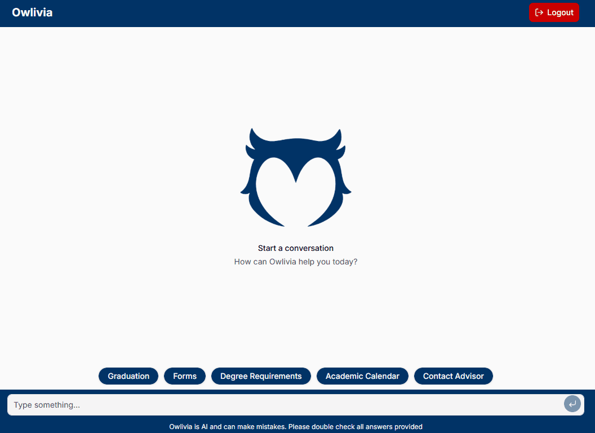

# Owlivia


 


## A STEM Graduate Advising Assistant for Florida Atlantic University

Owlivia is an AI-powered advising assistant that provides students with a conversational interface for finding information from official Florida Atlantic University resources. It answers general advising questions, provides relevant source links, and directs students to a human advisor when a question requires personalized or official guidance.



## Features

- Conversational advising through a chatbot interface
- Answers based on official FAU resources
- Source links included with responses
- Retrieval-augmented generation
- Support for follow-up questions
- Responsive desktop and mobile interface
- Escalation to human advisors when necessary

## How It Works

1. A student submits a question through the Owlivia chat interface.
2. The frontend sends the question to the backend server.
3. The system searches FAU resources for relevant information.
4. The language model generates an answer using the retrieved information.
5. Owlivia returns the answer with supporting source links.
6. Questions requiring personalized or official guidance are redirected to an academic advisor.

## Technology Stack

- **Frontend:** Next.js, React, Tailwind CSS, shadcn/ui, and AI SDK
- **Backend:** Python, Gemini API, and LanceDB
- **Development and Deployment:** GitHub, Vercel, and Render

## Getting Started

### Clone the Repository

```bash
git clone https://github.com/seamanc2016/owlivia.git
cd owlivia
```

### Install Frontend Dependencies

```bash
npm install
```

### Environment Variables

Create a `.env` file in the root directory:

```env
GOOGLE_GENERATIVE_AI_API_KEY= [YOUR GEMINI API KEY]
TAVILY_API_KEY= [YOUR TAVILY API KEY]
```

### Run the Frontend

```bash
npm run dev
```

Open the application at:

```text
http://localhost:8000
```

## Scope and Limitations

Owlivia was primarily targeted toward STEM Graduate students at FAU. Additionally, the application currently uses a simulated authentication process.


## Disclaimer

Owlivia was created for educational purposes and is NOT an official replacement for Florida Atlantic University academic advising. University requirements and policies may change. Students should verify important information using the cited FAU resources or contact an academic advisor.

Generative AI was utilized in the creation of this application for graphic design and general implementation.
